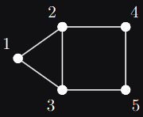

Max cut
=============

Consider the following undirected graph with 5 nodes

.. figure:: graph_light.png
    :figclass: light-only
    :align: center
    :alt: Simple directed graph with 5 nodes

The semidefinite approximation of the max cut problem :ref:`[1] <maxcut_refs>` 
corresponding to this graph is

.. math::

    \max_{X \in \mathbb{S}^5} &&& \langle C, X \rangle

    \text{subj. to} &&& X_{ii} = 1 \qquad i=1,\ldots,5

    &&& X \succeq 0,

where

.. math::

    C = \begin{bmatrix} 
            2 & -1 & -1 &  0 &  0 \\ 
           -1 &  3 & -1 & -1 &  0 \\
           -1 & -1 &  3 &  0 & -1 \\
            0 & -1 &  0 &  2 & -1 \\
            0 &  0 & -1 & -1 &  2
        \end{bmatrix}.

We show how we can solve this semidefinite program using QICS below.

.. code-block:: python
    
    import numpy as np

    import qics

    # Define objective function
    C = numpy.array([
        [ 2., -1., -1.,  0.,  0.],
        [-1.,  3., -1., -1.,  0.],
        [-1., -1.,  3.,  0., -1.],
        [ 0., -1.,  0.,  2., -1.],
        [ 0.,  0., -1., -1.,  2.]
    ])
    c = -qics.vectorize.mat_to_vec(C)

    # Build linear constraint
    A = np.zeros((5, 25))
    A[np.arange(5), np.arange(0, 25, 6)] = 1.

    b = np.ones((5, 1))

    # Define cones to optimize over
    cones = [qics.cones.PosSemidefinite(5)]

    # Initialize model and solver objects
    model  = qics.Model(c=c, A=A, b=b, cones=cones)
    solver = qics.Solver(model, verbose=0)

    # Solve problem
    info = solver.solve()

    X_opt = info["s_opt"][0][0]
    print("Optimal matrix variable X is:")
    print(X_opt)
    print("which has rank:", np.linalg.matrix_rank(X_opt, tol=1e-6))

.. code-block:: none

    Optimal matrix variable X is:
    [[ 1.         -0.36684149 -0.3668415   0.12486877  0.12486877]
     [-0.36684149  1.         -0.73085463 -0.96880942  0.87719533]
     [-0.3668415  -0.73085463  1.          0.87719533 -0.96880942]
     [ 0.12486877 -0.96880942  0.87719533  1.         -0.96881558]
     [ 0.12486877  0.87719533 -0.96880942 -0.96881558  1.        ]]
    which has rank: 2

Complex max cut
--------------------

In signal processing :ref:`[2] <maxcut_refs>`, the following complex variation 
of the semidefinite relaxation of max cut arises

.. math::

    \min_{X \in \mathbb{H}^n} &&& \langle C, X \rangle

    \text{subj. to} &&& X_{ii} = 1 \qquad i=1,\ldots,5

    &&& X \succeq 0,

where

.. math::

    C = \text{diag}(v)(\mathbb{I} - UU^\dagger)\text{diag}(v)

for some complex matrix :math:`U \in \mathbb{C}^{n \times m}` and real vector
:math:`v \in \mathbb{R}^n`. We can solve this in **QICS** by making a few 
adjustments to the previous code.

.. code-block:: python

    import numpy as np

    import qics

    np.random.seed(1)

    n = 5
    m = 4
    vn = qics.vectorize.vec_dim(n, iscomplex=True)

    # Generate random linear objective function
    U = np.random.randn(n, m) + np.random.randn(n, m)*1j
    v = np.random.randn(n)
    C = np.diag(v) @ (np.eye(n) - U @ U.conj().T) @ np.diag(v)
    c = qics.vectorize.mat_to_vec(C)

    # Build linear constraints  Xii = 1 for all i
    A = np.zeros((n, vn))
    A[np.arange(n), np.arange(0, vn, 2 * n + 2)] = 1.

    b = np.ones((n, 1))

    # Define cones to optimize over
    cones = [qics.cones.PosSemidefinite(n, iscomplex=True)]

    # Initialize model and solver objects
    model  = qics.Model(c=c, A=A, b=b, cones=cones)
    solver = qics.Solver(model)

    # Solve problem
    info = solver.solve()

    X_opt = info["s_opt"][0][0]
    print("Optimal matrix variable X is: ")
    print(np.round(X_opt, 3))
    print("which has rank:", np.linalg.matrix_rank(X_opt, tol=1e-6))

.. code-block:: none

    Optimal matrix variable X is:
    [[ 1.   +0.j     0.209-0.978j  0.67 -0.743j -0.584+0.812j  0.866-0.499j]
     [ 0.209+0.978j  1.   +0.j     0.866+0.499j -0.916-0.401j  0.67 +0.743j]
     [ 0.67 +0.743j  0.866-0.499j  1.   +0.j    -0.994+0.11j   0.951+0.309j]
     [-0.584-0.812j -0.916+0.401j -0.994-0.11j   1.   +0.j    -0.911-0.412j]
     [ 0.866+0.499j  0.67 -0.743j  0.951-0.309j -0.911+0.412j  1.   +0.j   ]]
    which has rank: 1

.. _maxcut_refs:

References
----------

    1. "Improved approximation algorithms for maximum cut and satisfiability 
       problems using semidefinite programming," M. X. Goemans, and 
       D. P. Williamson, Journal of the ACM (JACM) 42.6 (1995): 1115-1145.

    1. "Phase recovery, maxcut and complex semidefinite programming",
       I. Waldspurger, A. d'Aspremont, and S. Mallat.
       *Mathematical Programming*, pp. 1-35, 2012.

