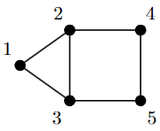

Max cut
=============

Consider the following undirected graph with 5 nodes

The semidefinite approximation of the max cut problem
corresponding to this graph is

.. math::

    \max_{X \in \mathbb{S}^5} &&& \langle C, X \rangle

    \text{s.t.} &&& X_{ii} = 1 \qquad i=1,\ldots,5

    &&& X \succeq 0,

where

.. math::

    C = \begin{bmatrix} 
            2 & -1 & -1 &  0 &  0 \\ 
           -1 &  3 & -1 & -1 &  0 \\
           -1 & -1 &  3 &  0 & -1 \\
            0 & -1 &  0 &  2 & -1 \\
            0 &  0 & -1 & -1 &  2
        \end{bmatrix}.

To solve this semidefinite program using **QICS**, we first 
define the objective function corresponding to the semidefinite
relaxation of the max cut problem.

.. code-block:: python
    
    import numpy as np

    c = -np.array([
        [ 2., -1., -1.,  0.,  0.],
        [-1.,  3., -1., -1.,  0.],
        [-1., -1.,  3.,  0., -1.],
        [ 0., -1.,  0.,  2., -1.],
        [ 0.,  0., -1., -1.,  2.]
    ]).reshape(-1, 1)

.. note::
    We define the objective as :math:`-C` as **QICS** always 
    assumes the linear function is being minimized.

Next, we define the linear constraint matrix corresponding to
:math:`X_{ii}=1` for :math:`i=1,\ldots,5`. To do this, we note
that these constraints are equivalent to

.. math::

   \text{tr}[A_i X] = 1, \qquad \forall\ i=1,\ldots,5,

where :math:`A_i` is the matrix with one in the :math:`(i, i)`-th
element and zeros everywhere else. Then we vectorize these 
matrices into row vectors and stack them on top of each other
(see :ref:`Mat to vec` for more details) to obtain our constraint matrix.

.. code-block:: python

    import scipy as sp

    A = np.zeros((5, 5, 5))
    A[range(5), range(5), range(5)] = 1.
    A = sp.sparse.csr_matrix(A.reshape(5, -1))

    b = np.ones((5, 1))

.. note::
    We represent the constraint matrix ``A`` as a sparse matrix, which
    can lead to significant speed ups for linear and semidefinite programs
    when ``A`` is sufficiently sparse.

We also need to define which cones we are optimizing over. In
this case we are just optimizing over the positive semidefinite cone.

.. code-block:: python

    import qics
    cones = [qics.cones.PosSemidefinite(5)]

Finally, we create a :class:`~qics.Model` to represent the maxcut
semidefinite program, and a :class:`~qics.Solver` to solve this problem. 

.. code-block:: python

    # Initialize model and solver objects
    model  = qics.Model(c=c, A=A, b=b, cones=cones)
    solver = qics.Solver(model)

    # Solve problem
    out = solver.solve()

    print("Optimal matrix variable X is: ")
    print(out["x_opt"].reshape(n, n))

.. code-block:: none

    ====================================================================
                QICS v0.0 - Quantum Information Conic Solver
                by K. He, J. Saunderson, H. Fawzi (2024)
    ====================================================================
    Problem summary:
            no. cones:  1                        no. vars:    25
            barr. par:  6                        no. constr:  5
            symmetric:  True                     cone dim:    25
            complex:    False

    ...

    Solution summary
            sol. status:  optimal                num. iter:    7
            exit status:  solved                 solve time:   1.096

            primal obj:  -8.741944078919e+00     primal feas:  7.95e-09
            dual obj:    -8.741944049469e+00     dual feas:    3.97e-09
            opt. gap:     3.37e-09

    Optimal matrix variable X is:
    [[ 0.99999999 -0.3668415  -0.3668415   0.12486877  0.12486877]
     [-0.3668415   0.99999999 -0.73085463 -0.96880942  0.87719533]
     [-0.3668415  -0.73085463  0.99999999  0.87719533 -0.96880942]
     [ 0.12486877 -0.96880942  0.87719533  0.99999999 -0.96881558]
     [ 0.12486877  0.87719533 -0.96880942 -0.96881558  0.99999999]]

Complex max cut
--------------------

In some instances, 